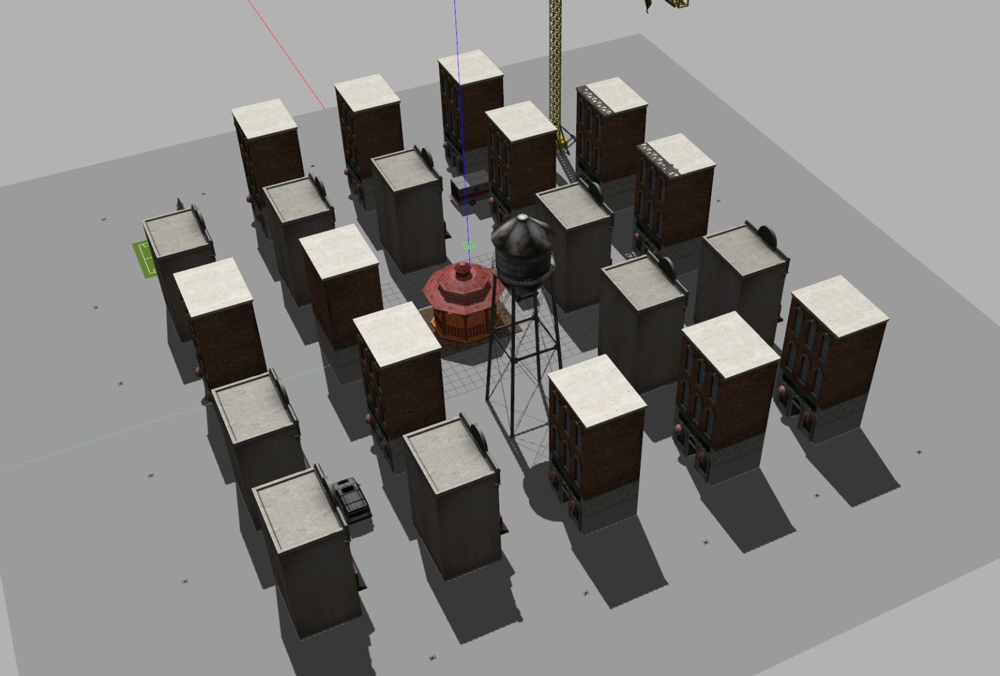

 [](https://codecov.io/gh/Apoorv-1009/PX4-Aerial-Swarm-Reconstruction) 

# PX4-Aerial-Swarm-Reconstruction
This project involves deploying multiple PX4 drones equipped with stereo cameras in a simulated city environment in Gazebo. The drones collaboratively map the city, generating a point cloud representation of the environment. The resulting point cloud is saved and can be visualized in RViz, providing a comprehensive 3D map of the simulated city.

## Contributors
- Mohammed Munawwar (munawwa@umd.edu): Driver phase 1, Navigator phase 2
- Apoorv Thapliyal (apoorv10@umd.edu): Navigator phase 1, Driver phase 2
- Kshitij Aggarwal (kshitij2@umd.edu): Design Keeper

# Phase 0
Phase 0 encompasses the project proposal, detailing the objectives and outlining the methodology to be employed for the software development process throughout the project. </br>
Product Dev Notes: [Link](https://docs.google.com/document/d/1IhdOAMICzZZBzhB9_Nkyce7AI6Z4n4CMd4ubZWPyqKw/edit?usp=sharing)

# Phase 1
As a part of phase 1 of this project, we successfully launched **20 Iris quadcopters** in a custom city world in Gazebo. Each drone operates independently, and we are able to retrieve critical telemetry data through ROS2 topics, including local position, IMU readings, and velocity. These topics enable real-time monitoring and control of the swarm, providing the foundations for advanced functionalities like collaborative mapping, trajectory planning, and obstacle avoidance in the next phase of the project. </br>


All documents pertaining to this phase can be found under `UML/initial` <br>
Product Dev Notes: [Link](https://docs.google.com/document/d/1IhdOAMICzZZBzhB9_Nkyce7AI6Z4n4CMd4ubZWPyqKw/edit?usp=sharing) <br>
Product Tracking Sheet: [Link](https://docs.google.com/spreadsheets/d/1d-81s3KT0pe81IKDCRShrfuD6AH13XsJ9yQLLJY3_XI/edit?usp=sharing) <br>

# Phase 2
As a part of Phase 2 of this project, we were able to control the swarm to do a controlled sweep of the grid world. Due to namespace issues, the pointcloud data is unavailable. However, the swarm controller works well, serving as a foundation for collaborative swarm mapping. <br>
All documents pertaining to this phase can be found under `UML/revised` <br>
Product Dev Notes: [Link](https://docs.google.com/document/d/1IhdOAMICzZZBzhB9_Nkyce7AI6Z4n4CMd4ubZWPyqKw/edit?usp=sharing) <br>
Product Tracking Sheet: [Link](https://docs.google.com/spreadsheets/d/1d-81s3KT0pe81IKDCRShrfuD6AH13XsJ9yQLLJY3_XI/edit?usp=sharing) <br>
Video Demonstration: [Link](https://youtu.be/DebJJggVpnA) <br>


# Setting up the Workspace

## Dependencies
Following are the major dependencies for this project, the PX4 setup tools would install any minor dependencies
```bash
ROS2 Humble
Gazebo-Classic
```

Install the following packages:
```bash
sudo apt install gnome-terminal
sudo apt install dbus-x11
sudo apt install ros-humble-gazebo-ros-pkgs ros-humble-gazebo-plugins

# HIGHLY RECOMMENDED: Add this to your ~/.zshrc or ~/.bashrc
# For ~/.zshrc:
echo "export GAZEBO_PLUGIN_PATH=$GAZEBO_PLUGIN_PATH:/opt/ros/humble/lib" >> ~/.zshrc
source ~/.zshrc
# For ~/.bashrc:
echo "export GAZEBO_PLUGIN_PATH=$GAZEBO_PLUGIN_PATH:/opt/ros/humble/lib" >> ~/.bashrc
source ~/.bashrc

```

## Setting up PX4-Aerial-Swarm-Reconstruction Repository
This repository contains the custom world files for the city simulation, along with the launch files for spawning the world with `n` drones (max 255).

```bash
# Clone this repository
git clone https://github.com/Apoorv-1009/PX4-Aerial-Swarm-Reconstruction.git
```

## Setting up PX4-Autopilot
The PX4 Autopilot is an open-source flight control software for drones and other autonomous vehicles, providing robust navigation, control, and communication capabilities. </br>
This must be built in the root folder, the following commands can be followed:

```bash
# Switch to /
cd ~/

# Clone the PX4 repository
git clone https://github.com/PX4/PX4-Autopilot.git --recursive

# Build the PX4 workspace and install the required dependencies
bash ./PX4-Autopilot/Tools/setup/ubuntu.sh

# External dependencies
pip install --user -U empy==3.3.4 pyros-genmsg setuptools

# Change to the PX4-Autopilot directory
cd PX4-Autopilot/

# Build the SITL software and Gazebo plugins
make px4_sitl gazebo-classic
```
## Setting up the ROS-GZ bridge
For getting camera topics, such as pointcloud, we need to setup a bridge between `Gazebo-Classic` and `ROS2`:
```bash
# Create a workspace for building the ROS-GZ bridge
mkdir -p ~/ros2_gz_ws/src

# Switch to this directory
cd ~/ros2_gz_ws/src

# Clone the ROS-GZ bridge repo
git clone https://github.com/gazebosim/ros_gz.git

# Switch to the cloned repo
cd ros_gz/

# Checkout to the Humble branch for ROS2 humble
git checkout humble

# Switch back to the root of this workspace
cd ~/ros2_gz_ws

# Build the workspace
colcon build 

# Source the workspace
source /install/setup.zsh

# HIGHLY RECOMMENDED: Add this to your ~/.zshrc or ~/.bashrc
# For ~/.zshrc:
echo "source /ros2_gz_ws/install/setup.zsh" >> ~/.zshrc
source ~/.zshrc
# For ~/.bashrc:
echo "source /ros2_gz_ws/install/setup.bash" >> ~/.bashrc
source ~/.bashrc
```

## Setting up Micro XRCE-DDS Agent & Client
For ROS 2 to communicate with PX4, uXRCE-DDS client must be running on PX4, connected to a micro XRCE-DDS agent running on the companion computer.

```bash
# Switch to /
cd ~/

# Clone the uXRCE package
git clone https://github.com/eProsima/Micro-XRCE-DDS-Agent.git

# Change to the Micro-XRCE-DDS-Agent directory
cd Micro-XRCE-DDS-Agent

# Make and switch to the build directory
mkdir build &&cd build

# Build the Micro-XRCE-DDS-Agent
cmake ..
make
sudo make install
sudo ldconfig /usr/local/lib/
```

Always keep the `uXRCE` agent running when doing simulations, else the drone topics would not be published. </br>
In a separate terminal:
```bash
# Switch to the Micro-XRCE-DDS-Agent directory
cd Micro-XRCE-DDS-Agent 

# Start the Micro-XRCE-DDS-Agent service
MicroXRCEAgent udp4 -p 8888
```

## Setting up the Simulation environment
To spawn our custom world, copy the `grid_plan.world` file into the `PX4-Autopilot` worlds directory
```bash
# Copy the world to the PX4-Autopilot worlds/ directory
cp ~/PX4-Aerial-Swarm-Reconstruction/src/px4_swarm_controller/worlds/grid_plan.world ~/PX4-Autopilot/Tools/simulation/gazebo-classic/sitl_gazebo-classic/worlds/
```

We also need to change the `sitl_multiple_run.sh` file to spawn drones at the positions as described by the `config.yaml` file.
```bash
cd ~/PX4-Aerial-Swarm-Reconstruction/
mv -i sitl_multiple_run.sh ~/PX4-Autopilot/Tools/simulation/gazebo-classic/sitl_multiple_run.sh
```

# Building the Environment
To build the workspace, go to the root of this package and run colcon build
```bash
cd ~/PX4-Aerial-Swarm-Reconstruction/
colcon build

# Make sure to source the workspace
source install/setup.bash   # bash users
source install/setup.zshrc  # zsh users
```

The `px4 msgs` folder is needed to define custom message types for communication between PX4 and ROS, enabling seamless integration and data exchange. <br>
This package must be sourced and included in every ROS2 PX4 workspace, it is highly recommended to add this to your `~/.zshrc` or `~/.bashrc`
```bash
# For ~/.zshrc:
echo "source /PX4-Aerial-Swarm-Reconstruction/install/local_setup.zsh" >> ~/.zshrc
source ~/.zshrc

# For ~/.bashrc:
echo "source /PX4-Aerial-Swarm-Reconstruction/install/local_setup.bash" >> ~/.bashrc
source ~/.bashrc
```

# Running the Simulation
To launch the city simulation in Gazebo with 20 drones (default):
```bash
ros2 launch px4_swarm_controller px4_multi_sim_launch.launch.py
```

If the simulation environment gives issues while spawning, try killing the gzserver and gzclient
```bash
killall gzserver gzclient
```
If you want to change the number of drones being spawned, their initial positions and the trajectory they follow, this can be done by adjusting the `config.yaml` located in `src/px4_swarm_controller/config/config.yaml`. 

To launch the drones and take sweeps of the city:
```bash
ros2 run px4_swarm_controller arm 
```

# Running L1 and L2 tests
```bash
# Build the package
rm -rf build/ install/ log/                                                                
colcon build --cmake-args -DCOVERAGE=1

# Test the packages
colcon test --packages-select px4_swarm_controller

# Optionally, you can test px4_msgs as well, however this is not needed
colcon test

# Run the tests and generate the coverage report
ros2 run px4_swarm_controller generate_coverage_report.bash      

# View the coverage reports
open build/px4_swarm_controller/test_coverage/index.html 
```

# Running Code Quality Checks
```bash
# Switch to the px4_swarm_controller package
cd ~/PX4-Aerial-Swarm-Reconstruction/src/px4_swarm_controller

# cpplint
cpplint --filter=-build/c++11,+build/c++17,-build/namespaces,-build/include_order src/*.cpp > ../../results/cpplint_output.txt

# cppcheck
cppcheck --enable=all --std=c++17 --suppress=missingIncludeSystem $(find . -name "*.cpp" | grep -vE -e "^./build/") --check-config > ../../results/cppcheck_output.txt

# To format the code under /libs and /src to Google C++ style
clang-tidy -extra-arg=-std=c++17 src/*.cpp
clang-tidy -extra-arg=-std=c++17 libs/Control/*.cpp
clang-tidy -extra-arg=-std=c++17 libs/Control/*.hpp

# Save the clang-tidy output with 
echo $? > ../../results/clangtidy_output.txt
```

# Doxygen
To generate Docs for the project, run the following command in the root of the directory:
```bash
./do-docs.bash
```

# Known Issues/Bugs
Due to a namespace error encountered while spawning the drones, we were unable to retrieve point cloud data from the drones, which unfortunately left the reconstruction section of this project incomplete. Despite our efforts to resolve the issue by seeking help on PX4 developer forums, ROS2 forums, and other platforms, we were unable to find a solution, likely due to the limited resources and documentation available on this specific topic for ROS2. However, the progress we have made so far serves as a robust foundation and a strong stepping stone for future city mapping projects utilizing a swarm of drones. <br>Currently, there are no known bugs in the program, and as long as `PX4-Autopilot` is built correctly, the provided codes will execute seamlessly out of the box.

# License

This project is licensed under the MIT License - see the [LICENSE](LICENSE) file for details.

# Disclaimer

This software is provided "as is," without any warranties or conditions, express or implied. By using this software, you acknowledge that Acme Robotics is not liable for any damages or issues arising from its use. Users are responsible for ensuring the software’s suitability and safety for their specific applications, especially in environments with humans.